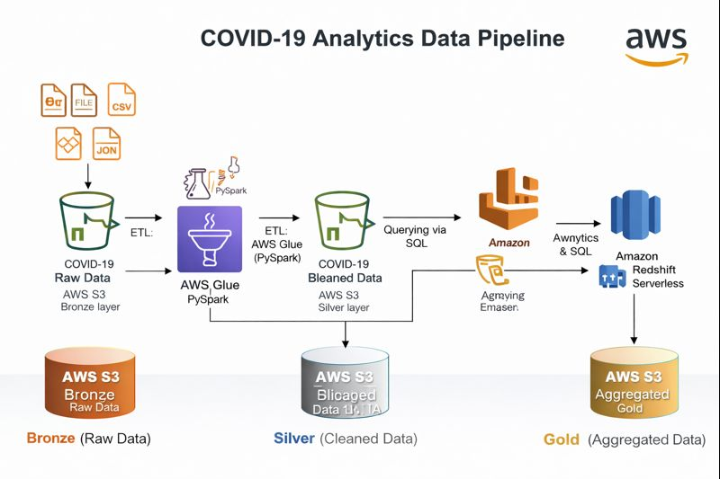

# COVID-19 Analytics Pipeline (AWS)

## 📌 Overview
This project implements an **end-to-end AWS-based data engineering pipeline** to ingest, transform, and analyze COVID-19 datasets. The solution enables scalable analytics using cloud-native services and SQL-based querying.

---

## 🛠 Tech Stack
- **Cloud:** AWS
- **Storage:** Amazon S3
- **Processing:** AWS Glue, PySpark
- **Querying:** Amazon Athena
- **Analytics:** Amazon Redshift Serverless
- **Format:** Parquet

---

## 🏗 Architecture

---

## 🔄 Data Pipeline Flow
1. Raw COVID-19 datasets ingested into **S3 (Bronze layer)**
2. Data cleaned and standardized using **AWS Glue (PySpark)**
3. Processed data stored in **S3 (Silver layer)** in Parquet format
4. Aggregated datasets modeled for analytics (**Gold layer**)
5. Data queried via **Athena** and loaded into **Redshift** for reporting

---

## 📈 Key Outcomes
- Built scalable cloud ETL pipelines  
- Enabled fast SQL analytics on large datasets  
- Designed analytics-ready data models  

---

## 🚀 Future Enhancements
- Add automated data quality checks  
- Integrate dashboards (Power BI / Tableau)  
- Schedule pipelines using AWS workflows
